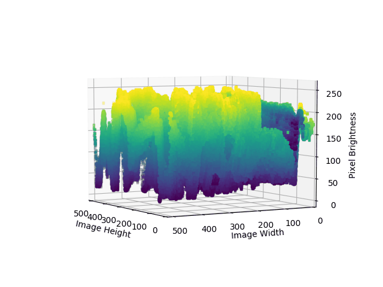

# 3Dimages
This is a small Python script to render your images into 3D plots and create an animated gif of it.

you can either show it as 3D scatterplot and manipulate it with your mouse, or if your PC is as slow as mine, just let the function run and render/save the various perspectives for you and let it create an animated gif.

The  source image can be of jpg, png, gif and maybe other formats.
Remember that the image should be small if you want decent processing times. This script does not render via the GPU or even more than one core, which makes it suuuper slow^^ 600x600 pixel image with 10 frames around 5 minutes to render and create the gif. Therefore the code resizes anything above 1MP to 1MP.
There is also some histogram stretching included for better outcome.

It is a very short and simple script but I had some fun with it.
There is huge space for improvement, so do not hesitate pushing new code into this repository ;)

